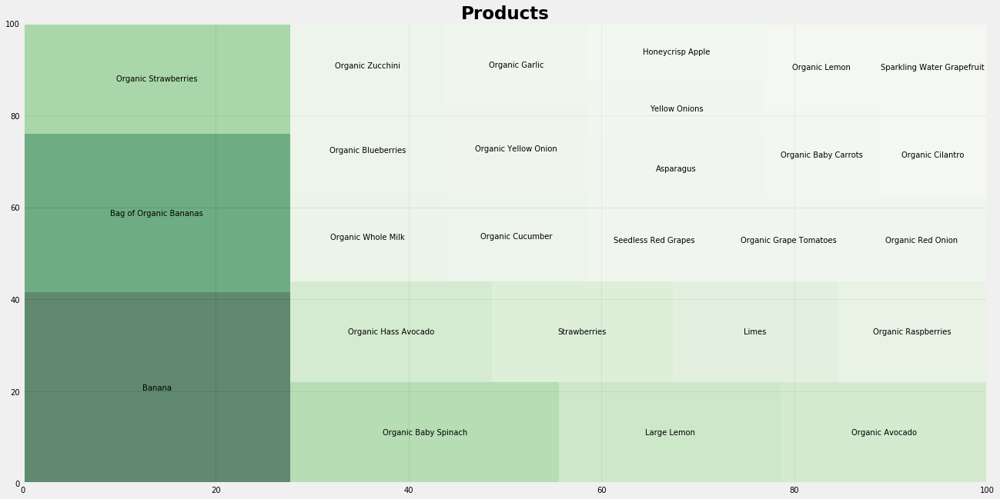
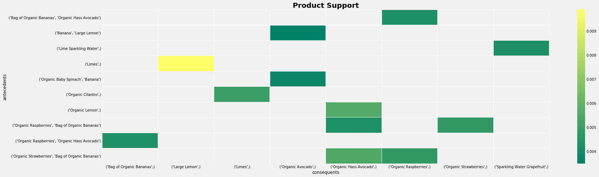
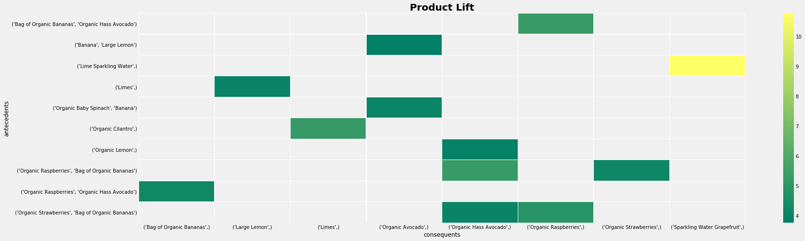

# Instacart Shopper 

> ### Which are Instacart's most frequntly bought item sets?

## Purpose
___

The aim of the project was to use machine learning to learn of Instacart’s customers preferences by analyzing the most frequently bought item sets.

## Tools Used
---

Machine Learning - Python (Mlxtend Library to import Apriori and Association Rules).

Visualizations - Tableau, Matlplotlib, Seaborn, Networkx

Data Manipulation - D3.js, JSON

Web - HTML, CSS, Flask, JavaScript, Heroku

## Data Source
---
We used Kaggle.com -- Instacart’s 2017 Online Grocery Shopping Dataset for our analysis: [Instacart Market Basket Analysis](https://www.kaggle.com/c/instacart-market-basket-analysis/data)

## Scope
---
To mine the frequent item sets and devise association rules from Kaggle’s Instacart dataset, we decided to use a machine learning algorithm called apriori (used Python mlxtend library to import apriori, and association rules).

## Findings
___

> ### Instacart Shoppers love Bananas and Organic Food!

> ### Instacart's Frequently Bought Item Sets

> ### Heatmaps of top 10 Product Rules

## Predictions
---

> ### Are you forgetting something?

> ### Select your Item
